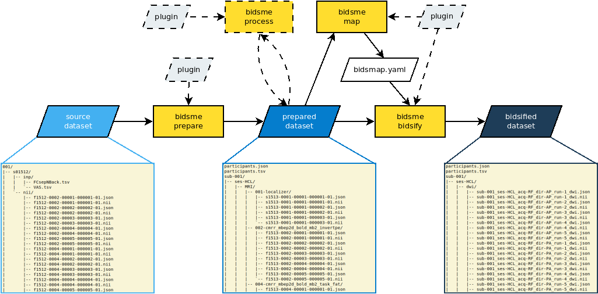

# Summary

The purpose of Bidsme is to organize a given medical image dataset following the "Brain Image Dataset Standard" (BIDS) [@Gorgolewski2016]. Bidsme is an all-in-one organizer tool, that not only renames and re-structures the original data files, but also extracts and formats the necessary metadata. During the data organization, Bidsme provides the user with the full control over these processes, allowing the use of non-standard metadata and file names, as well as the addition of modalities not yet described by the BIDS. Instead of strictly imposing this standard, Bidsme allows the user to fully configure how the source dataset will be organized and what metadata will be included. Bidsme can be used both as python package and command-line tool, and includes a tutorial with a test dataset.

# Statement of need

For a long time, the neuroimaging community suffered by a lack of standardization of stored datasets, formats and metadata conventions. Different laboratories (and even different research groups within a laboratory) had their own, idiosyncratic ways to organize their data. Analysis was performed with scripts tailored to a specific data structure, which made sharing data and analysis methods unnecessarily complicated. Consequently, it was difficult to ensure results repeatability and validation.

The situation started to change after the introduction of the Brain Image Dataset Standard (BIDS) [@Gorgolewski2016], which imposes a standard structure to stored data, and defines the required associated metadata. Once a dataset follows the imposed structure, any analysis tool, supporting the BIDS, should be able to automaticaly find the needed data and process it.

While, prior to the introduction of BIDS, the main challenge was to adapt a given processing script to a different (typically inconsistent) dataset structures, with the advent of BIDS the main challenge is to adapt a given dataset to the BIDS. Not only the image files must be named as close as possible to the standard, but also the associated metadata must contain all expected values, using expected conventions and measurement units.

The challenge increases for datasets acquired prior to the introduction of BIDS, where often mandatory information may not even be present in the original data, or be encoded in a non-common way. This makes it difficult to use generalized tools like, e.g. [dcm2niix](https://github.com/rordenlab/dcm2niix) [@Li2016]. Any new experimental acquisition protocol may introduce new important metadata, which risks to be ignored by generalized tools. Developers will do their best to incorporate the most popular protocols, but the most exotic ones will be probably overlooked. Other tools, like, e.g. [Bidscoin](https://github.com/Donders-Institute/bidscoin) [@Zwiers2022] may rely on conventions used in the laboratory of the developers, and may be difficult to use in laboratories following different conventions.

The ideal bidsification tool must be able to be flexibly adapted to any original data structure and to any reasonable laboratory practices. It must try to retrieve as much necessary metadata as possible, but also allow the user to add additional metadata. It must suggest to follow the current standard but allow to deviate from it, e.g. when a given modality is not defined in BIDS or in case of future development of BIDS.

These fundamental principles have been adopted as guidelines for the development of the Bidsme. Bidsme gives full control of the bidsification to the user, imposing only the core of BIDS -- the folder structure, the file naming style and the global metadata. The actual names and set of entities are suggested to the user but are not imposed. Likewise, the user is free to add, remove or modify any automatically retrieved metadata.

# Bidsme overview and usage

The bidsification workflow using the Bidsme is presented in Fig \autoref{fig:workflow}. It is organized into two main steps: the "preparation" and the "bidsification".

The preparation step, as the name indicates, prepares the dataset for bidsification: it organizes the dataset into BIDS-like structure, with separate folders for each subject and session. The standardized structure of the prepared dataset not only facilitates further bidsification, but also helps with visual inspection of data integrity and provides an opportunity for intervention into the dataset (e.g. with removal of corrupted or failed data samples), while keeping the original dataset safe from any manipulation. Several original datasets can be prepared into the same dataset, as long as there is no overlapping data. This can be useful when bidsifying datasets with several modalities (MRI, EEG, PET).

The proper bidsification step is then performed on the prepared dataset. Bidsme scans for all data and with the help of a configuration file, i.e. `bidsmap.yaml`, it identifies each data file, it generates the new bidsified name, and it exports the desired metadata into sidecar json file.

The aforementioned `bidsmap.yaml` configuration file is the central piece of the bidsification workflow. For each supported data format and data type (Tab \autoref{tab:formats}), it defines a set of criteria to identify a given modality and a set of rules to bidsifiy the identified files. Identification criteria will match a given data file metadata with user-defined values, and in case of success, the bidsification rules will be applied. The file-naming rules are defined as a list of entities and corresponding values, which can be either provided by the user or retrieved dynamically from the metadata. The metadata rules in the sidecar `.json` file are defined in the same way, allowing the user to automatically export given values from the metadata, or provide a value manually.

Bidsme implements a flexible system of plugins, that can be used at any stage. A plug-in is a python file with a set of user-implemented functions, which are executed at important points of processing and gives access to the relevant data. Usage of plugins allow, for example, rename subjects and sessions, provide subject-related metadata, incorporate auxiliary data into dataset (e.g. physiological), add user calculated values into metadata, control data integrity, and so forth. To help with the implementation of the plugins, Bidsme provides a template, which describes the signature of plugins, and a set of helper functions that implement common tasks, for example assembling a set 3D MRI images into one 4D MRI image, or extract b-values from diffusion MRI image.

# Supported data types and formats

Bidsme was developed to work with multiple data types and data formats. At the time of writing, Bidsme supports MRI, PET and EEG data types and a variety of data formats, summarized in Tab \autoref{tab:formats}.

| Modality | Data format | Module required |
| --------     | -----------        | -------------             |
| MRI        | NIfTI            | nibabel              |
|              | NIfTI+JSON  |                           |
|              | dicom          | pydicom            |
| PET        | NIfTI            | nibabel              |
|              | NIfTI+JSON  |                           |
|              | dicom          | pydicom             |
|              | ECAT            | nibabel               |
| EEG       | BrainVision   | mne                   |
|              | EDF/EDF+    | mne                   |

Bidsme was implemented using an object-oriented approach, where the interactions with the actual data files are implemented in base class in the Modules package. Every data type inherits from the base class and implements the BIDS requirements for that data type. Interactions with the data files are defined in a class which inherits from data type class and implements the metadata extraction, file validation, copy etc. Hence, it is relatively easy to expand Bidsme to support new data modalities and formats,  simply by creating a new class and defining a handful of low-level functions. This allow to quickly include additional data modalities, even if they are not currently supported by BIDS (for example, MEG or actigraphy data).

# Acknowledgements

This work and Nikita Beliy were supported by the Fonds National de la Recherche Scientifique (F.R.S.-FNRS, Belgium) through Grant No. EOS 30446199 and the University of Liège. Christophe Phillips is supported by the Fonds National de la Recherche Scientifique (F.R.S.-FNRS, Belgium).

As Bidsme was developped basing on [Bidscoin](https://github.com/Donders-Institute/bidscoin)[@Zwiers2022] package, we would like to thanks its developpers, and in particular it lead developper Marcel Zweirs.

# References
